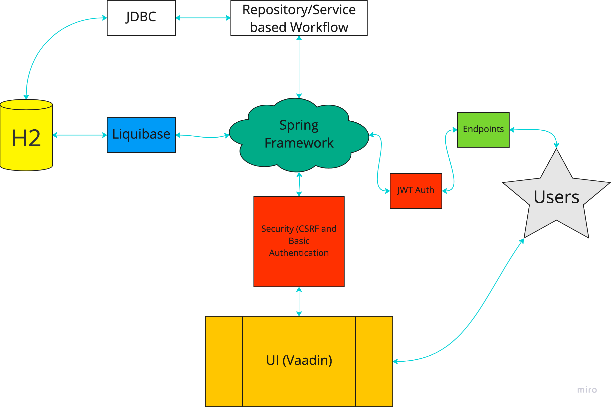
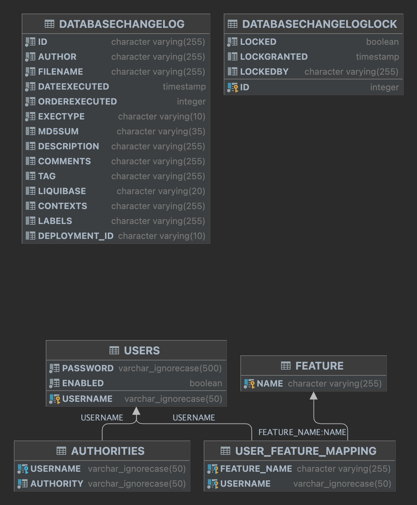
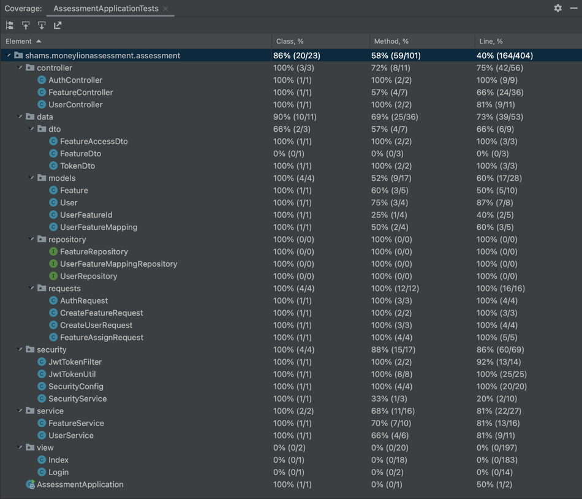

# MoneyLion Assessment
This is an implementation of an assessment requested for a particular job application role. 
This repository is also created for acting as a template for future projects and will continue and maintained for development
purpose. Please feel free to use each section of this template for your future spring boot projects.

#### Demos
- [API Demo](https://github.com/ShamsUlAzeem/MoneyLionAssessmentEndToEnd#51-api-based)
- [UI Demo](https://github.com/ShamsUlAzeem/MoneyLionAssessmentEndToEnd#52-ui-based)
- [Online UI]()
- [API Docs]()
- [OpenAPI YAML Specifications](open-api-specification.yaml)

# 1. Problem Statement (User Story)
As Product Manager, I would like to manage users’ accesses to new features via feature switches, 
i.e. enabling/disabling certain feature based on a user’s email and feature names).

## 1.1 Minimum Requirements
Main requirements for this assessment are implementation of the following two endpoints

1. `GET /feature?email=XXX&featureName=XXX`
    
    This endpoint receives   (user’s email) and featureName as request parameters and returns the following response in JSON format.

    #### Example Response

   ```json
   {
       "canAccess": true|false (will be true if the user has access to the featureName)
   }
   ```
    
2. `POST /feature`
    
    This endpoint receives the following request in JSON format and returns an empty response with HTTP Status OK (200) 
    when the database is updated successfully, otherwise returns Http Status Not Modified (304).

    #### Example Request

    ```json
    {
      "featureName": "xxx", (string)
      "email": "xxx", (string) (user's name)
      "enable": true|false (boolean) (uses true to enable a user's access, otherwise)
    }
    ```

## 1.2 Assumptions for Framework Selections
Since the assessment indicates an open-ended solution, I've taken the following design considerations for the implementation.
1. Java as base language
2. Database (H2 selected here) capable of the following modes
   1. In-memory (for repeatable tests without teardown methods)
   2. Embedded file mode (for making executable package delivery simpler)
   3. Server mode (for concurrency, multi-access, scalability if needed)
3. UI platform for convenience (Vaadin chosen because of Java based UI builders)
4. Liquibase for keeping and validating migration checksum
5. Security based features include
   1. JWT Token authentication
   2. CSRF tokens for UI based usage protection
   3. Last but not least a decent password encrpytion using Bcrypt
6. Spring Boot Application framework for main implementation
7. Testing framework using Mock Mvc framework
8. Planning for standalone native binaries for testing in systems without JDK or JVM runtime installed, using graalvm image builder
9. Planning for CI/CD using GitHub workflows 
10. Generation of OpenAPI specification from javax annotation framework for the ability to generate polyglot clients
11. Deployment on AWS EC2 instance for demo

# 2. Architecture
Since the endpoints use case indicate a storage mechanism so, the data is stored in H2 database. Database changeloge and 
migrations are validated through liquibase framework and is convenient for future proofing updates.

Security is done through two mechanisms. One of them is through JWT token generation and validation through a custom 
created principal mechanism. This is done to protect unwanted access to the mentioned endpoints above. The second 
protection mechanism is for protecting UI through CSRF token for preventing cross site request forgery and basic username
and password based authentication maintained through spring boot session IDs inside cookies.

The following diagram shows in a simplified manner, how each component interact with each other.



# 3. Database View

The top two tables show migration and versioning logs for liquibase framework and the 4 tables below is how features and
users are mapped together.

---
**NOTE**

The tables for AUTHORITIES and USERS are in total sync with the user principles of Spring boot security framework and are
also maintained through liquibase migration changelogs.

---
# 4. Tests and Coverage


# 5. Demo
The following two demos shows how the application works in different modes

## 5.1. API Based


## 5.2. UI Based


# 6. Future Plans
Future plans includes:
1. Maintenance of CI/CD creation of native binaries for production releases use with graalvm.
2. API documentation through javadoc comments and source code/api exploration through GitHub pages
3. Better test coverage for UI
